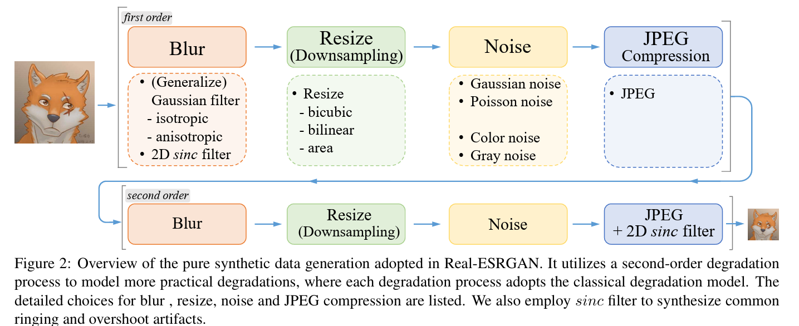
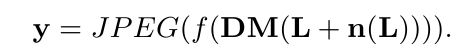
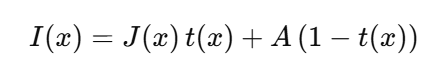
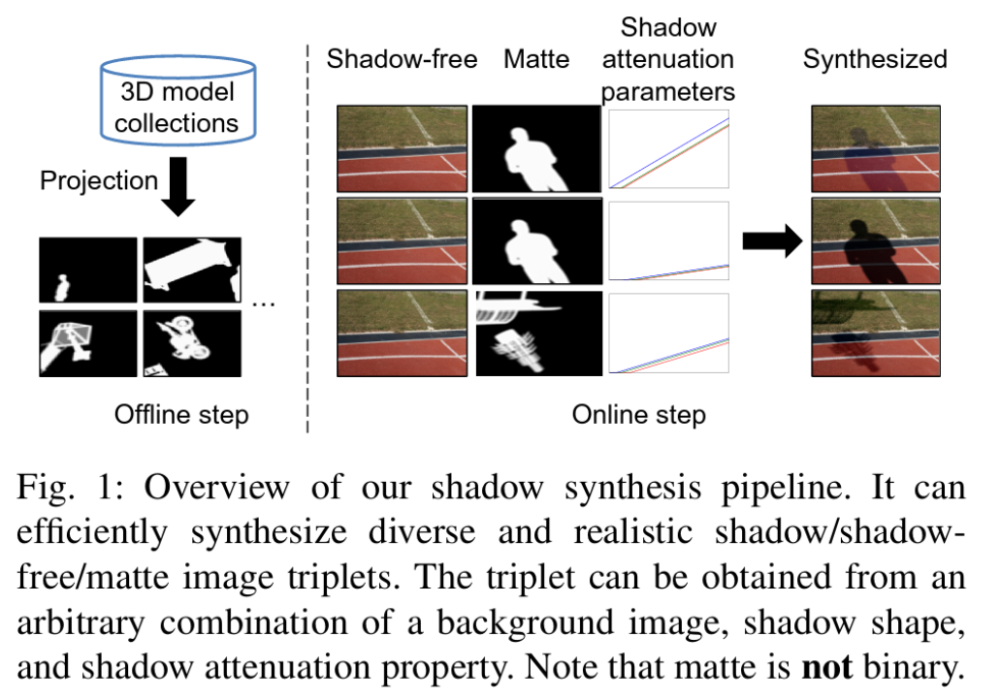
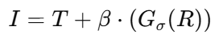

# VisualQuality-Bench

This repository records common image processing tasks with their synthetic data construction procedures.

## Image Processing Tasks

### Image Restoration Tasks
- Super-Resolution
    - Synthetic data construction
        - For non-generative methods: Bicubic downsampling (x2, x4)
        - For generative methods: RealESRGAN degradation [[RealESRGAN Paper](https://arxiv.org/abs/2107.10833)] 
            
    - SOTA methods
        - SwinIR, HAT, DiffBIR, SeeSR, OSEDiff, HyperIR
- Denoising
    - Synthetic data construction
        - Camera perception: [[Unprocessing pipeline](https://arxiv.org/abs/1811.11127)]
        - CBDNet degradation: [[CBDNet](https://arxiv.org/abs/1807.04686)] (the most common) 
            
    - SOTA methods
        - CBDNet, SwinIR, Restormer, X-Restormer, 
- Deblurring
    - Synthetic data construction
        - [[Levin Dataset Kernels](https://ieeexplore.ieee.org/document/5963691)]
        - Gaussian kernel + motion kernel + noise
    - SOTA methods
        - MAXIM, LaKDNet, EVSSM, 
- Deraining
    - Synthetic data construction
        - Rain streak, Raindrop, Rain and mist [[MPID Dataset](https://arxiv.org/abs/1903.08558)]
    - SOTA methods
        - DiffPlugin, Restormer, MPRNet,
- Desnowing
    - Synthetic data construction
        - Manual mask + random overlay + brightness change [[Snow100K](https://arxiv.org/abs/1708.04512)]
    - SOTA methods
        - DesnowNet,
- Dehazing
    - Synthetic data construction
        - Atmospheric Scattering Model [[RESIDE](https://arxiv.org/abs/1712.04143)] 
            
    - SOTA methods
        - DehazeFormer (2023), RIDCP (2023),
- Inpainting
    - Synthetic data construction
        - Free-form irregular masks and rectangular masks [[SN-PatchGAN](https://arxiv.org/abs/1806.03589)]
    - SOTA methods
        - SN-PatchGAN (2019),
- Shadow Removal
    - Synthetic data construction
        - [[SynShadow](https://arxiv.org/abs/2101.01713)] 
            
    - SOTA methods
        - DHAN (2019), 
- Reflection Removal
    - Synthetic data construction
        - [[Zhang et al.](https://arxiv.org/abs/1806.05376)] 
            
    - SOTA methods
        - CEILNet (2017), Zhang et al. (2018), 

### Image Enhancement Tasks
- Low-Light Enhancement
    - Synthetic data construction
        - Reversed ISP + Exposure Degradation + Noise Degradation + White Balance & CCM + Tone Mapping + Forward ISP [[SynLLIE](https://ojs.aaai.org/index.php/AAAI/article/view/32617)]
    - SOTA methods
        - SNR-LLIE (2022), Retinexformer (2023), 
- Color Enhancement
    - Synthetic data construction
    - SOTA methods
- Underwater Image Enhancement
- Multi-Exposure Fusion
- Depth-aware Image Enhancement
- Rendering

### Tone Mapping Tasks
- HDR Tone Mapping 

### Face and Portrait Restoration Tasks
- Old Photo Restoration
- Face Inpainting
- Face Super-Resolution 1000
- Face Editing
- Deepfake Generation

### Image Generation Tasks
- Style Transfer (I2I)
- Cartoonization
- Text-to-Image Synthesis
- Image Outpainting

### Compression Tasks
- Traditional Compression (JPEG, WebP, HEIC, etc.)
- Learned Image Compression

### Geometry-Aware Image Generation Tasks
- Novel View Synthesis
